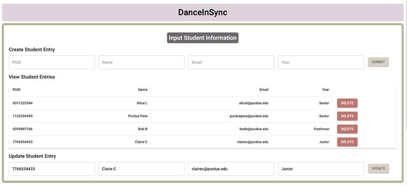
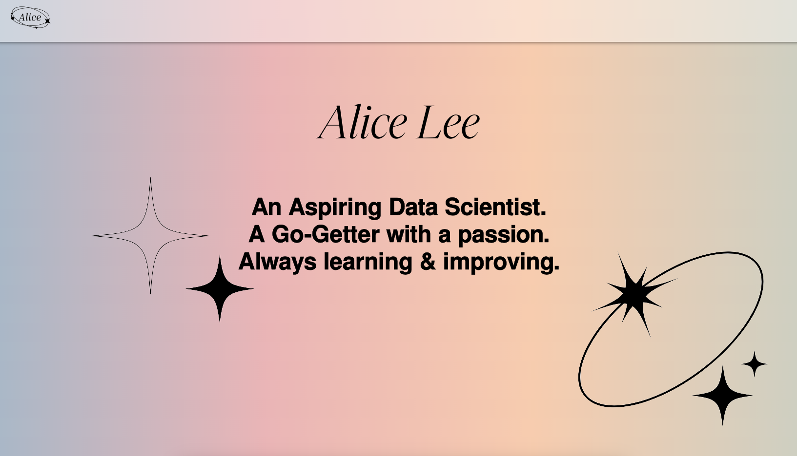

## 

I am a Data Engineer with a Bachelor of Science in Data Science and a minor in Management obatined at Purdue University.

## 📝 Currently,
at Ecolab, working with AI!

## 📁 In the past...
I was a data engineer + assistant for the College of Science Data Management office for two years, where I worked with various data including admissions, degrees, majors, and retention to create visualizations and faciliate for easier use of Tableau, as well as rewriting statistical reports with python for better readability, usage, and efficiency.

I worked as an automation intern at Ecolab, working with the Operation Automations team to create automations with Python and REST APIs, as well as Swimlane, which helps our IT department efficiently handle tickets and tasks that get requested. During the internship, I also worked on a hackathon where I was able to utilize data cleaning, manipulation, and visualization, to create a geo-spacial map in Power BI using unstructured, uncleaned data over 3 million rows.

I worked as a data science intern at Midcontinent Independent System Operator (MISO) during the summer of 2023 and throughout the fall semester of 2023 as a part-time intern to focus on automating data cleaning and analyzing processes, as well as visualizing and optimizing big data using Tableau, Python, and SQL.

## Check out my most recent project: Dance in Sync!

## 👩‍💻 Check out my Website!

## :computer: Skills 

  

  

## :phone: Stay in Touch!

 

